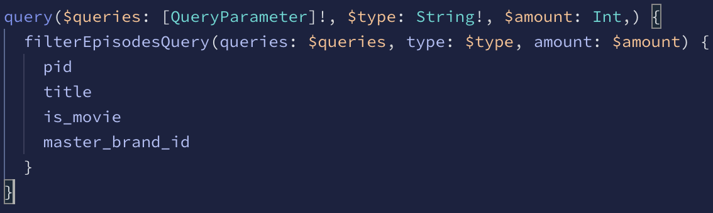
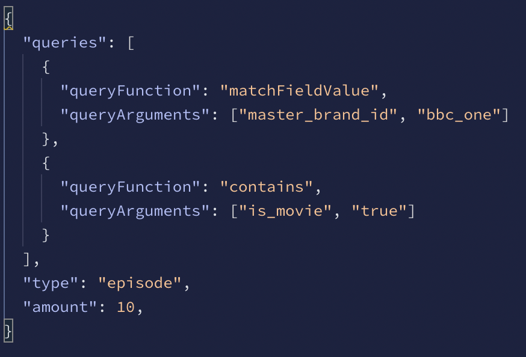

# graphql-catalogue-querier

###### Note this project is very early in development so a lot of this could change.

### Overview
This is a graphql based application that will allow users to query the catalogue for very specific scenarios and situations.
May also be useful when creating stub data for tests.

###### Technolgies Used

&ndash; [Appollo GraphQL](https://www.apollographql.com/) and JavaScript will be used to create the main application and querying language.

&ndash; [Jest](https://jestjs.io/) will be used to test the Apollo GraphQL app.

&ndash; [Terraform](https://www.terraform.io/) will be used to provision and deploy infrastructure to AWS.

&ndash; [Jenkins](https://www.jenkins.io/) will be used for CI/CD.

&ndash; I may add a user friendly [React](https://reactjs.org/) front end to the application so non-technical users can also use the tool.

#### Potential Scenarios
The application currently has some very basic queries, but I am starting to develop more detailed ones.

##### Basic Queries

| Name   |      Description      |  Arguments |
|--------|:---------------------:|-----------:|
| getAllEpisodes | Get all episodes. | None |
| getAllSeries | Get all series. | None |
| getAllBrands | Get all brands. | None |
| getNumberOfEpisodes | Get a specified number of random episodes. | amount(Number) |
| getEpisodeTreeForPid | Get an episode, series and brand related to a PID. | pid(String) |
| getEpisodeSiblings | Get an episodes sibling episodes. | pid(String) |
  
##### Detailed Queries
filterEpisodesQuery is used to query the data. This is where most development will be done and the table below shows
what functions can be ran using this feature, along with an image to show what a query (left) and arguments (right) would look like in the editor.

  
  

  
| Name   |      Description      |  Arguments |
|----------|:-------------:|------:|
| contains | Checks a specified field in each item and checks if it exists. | field, contains |
| matchFieldValue | Checks if a field is equal to a specified value | field, value |

### Development 
Trello was used to help manage the creation of this project. [Check out the Board](https://trello.com/invite/b/LC6ChGmH/3d20872210f1f1bd6d93bb0de65fb0cd/graphql-catalogue-querier)

### Testing

### Running
Currently you need to download a v2 catalogue and put it in the root path folder at path `data/v2Cat.json`. This is something that will not be needed in the future.

`npm start`

### Deploying
